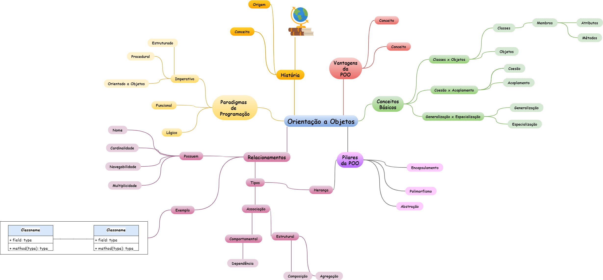

~~~mermaid
mindmap
    [Orientação a Objetos]
        
        (Classe)
            (Atributos)
            (Métodos)
            (Modificadores de Acesso)

        (Objeto)
            (Instância)
            (Estado e Comportamento)

        (Pilares)
            (Abstração)

            (Encapsulamento)
                (Privacidade de dados)
                (Getters e Setters)
                (Modificadores) 
                    (Public, Private, Protected)
                
            (Herança)
                (Generalização e Especialização)
                (Superclasse e Subclasse)
                (Polimorfismo)

            (Polimorfismo)
                (Sobrecarga de Métodos)
                (Sobrescrita de Métodos)
                (Classes Abstratas)
                (Interfaces)

        (Relacionamentos)
            (Associação)
                (Direção)
                    (Unidirecional)
                    (Bidirecional)
                (Tipos)
                    (Estrutural)
                        (Agregação)
                            (Relacionamento tem-um)
                            (Independência entre classes)

                        (Composição)
                            (Relacionamento parte de)
                            (Dependência de existência)
                    (Comportamental)
                        (Dependência)
                            (Uso temporário de uma classe)
                            (Relação fraca)
~~~

~~~mermaid
mindmap
    (Orientação a Objetos)
        (Pilares)
            (Encapsulamento)
                (Ocultação de detalhes internos)
                (public, private, protected)
            (Herança)
                (Reutilização de código)
                (Relação é um)
                (Superclasse e Subclasse)
            (Polimorfismo)
                (Múltiplas formas para um mesmo método)
                (override)
                (overload)
            (Abstração)
                (Simplificação da complexidade)
                (Classes abstratas)
                (Interfaces)
        (Conceitos Fundamentais)
            (Classe)
                (Modelo ou blueprint para objetos)
                (Atributos e métodos)
            (Objeto)
                (Instância de uma classe)
                (Estado e comportamento)
            (Atributos)
                (Variáveis que armazenam dados)
            (Métodos)
                (Funções que definem comportamentos)
        (Relacionamentos entre Classes)
            (Associação)
                (Relação genérica entre classes)
                (Unidirecional ou bidirecional)
            (Agregação)
                (Relação todo-parte - fraca)
                (Partes existem independentemente)
            (Composição)
                (Relação todo-parte - forte)
                (Partes dependem do todo)
            (Herança)
                (Relação hierárquica)
                (Subclasse herda da superclasse)
            (Dependência)
                (Relação temporária)
                (Uso pontual de uma classe por outra)
        (Princípios SOLID)
            (Single Responsibility Principle - SRP)
                (Uma classe deve ter uma única responsabilidade)
            (Open/Closed Principle - OCP)
                (Aberto para extensão, fechado para modificação)
            (Liskov Substitution Principle - LSP)
                (Subclasses devem ser substituíveis por suas superclasses)
            (Interface Segregation Principle - ISP)
                (Interfaces específicas são melhores que uma geral)
            (Dependency Inversion Principle - DIP)
                (Depender de abstrações, não de implementações)
        (Outros Conceitos)
            (Construtor)
                (Método especial para inicializar objetos)
            (Destrutor)
                (Método especial para liberar recursos)
            (Sobrecarga de Métodos)
                (Múltiplos métodos com o mesmo nome, mas parâmetros diferentes)
            (Sobrescrita de Métodos)
                (Subclasse redefine um método da superclasse)
            (Classes Abstratas)
                (Não podem ser instanciadas)
                (Podem ter métodos abstratos)
            (Interfaces)
                (Contrato que define métodos obrigatórios)
                (Sem implementação)

~~~
