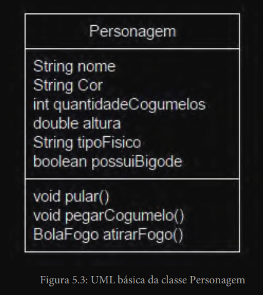
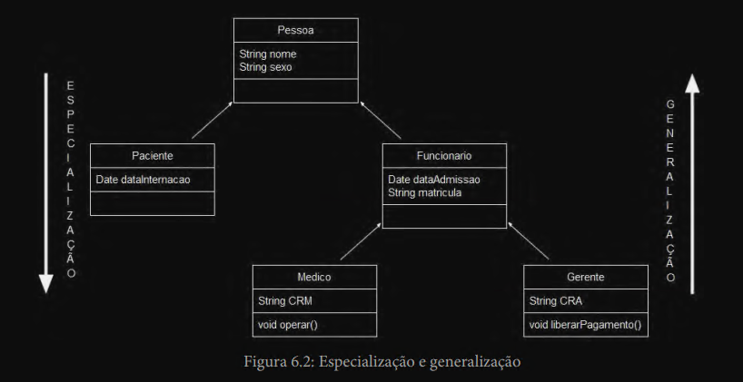
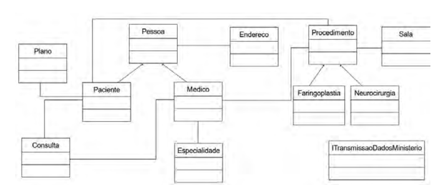
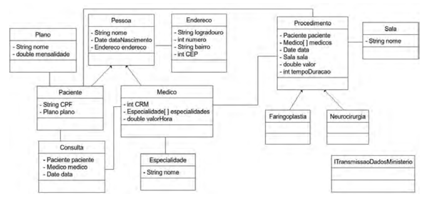
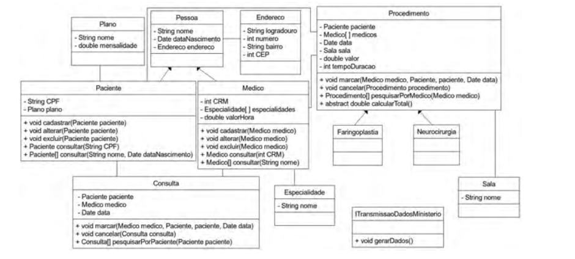
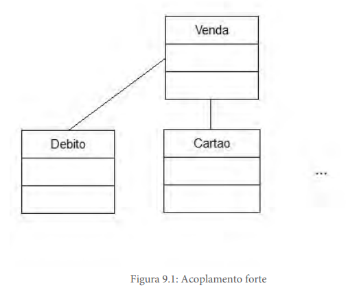
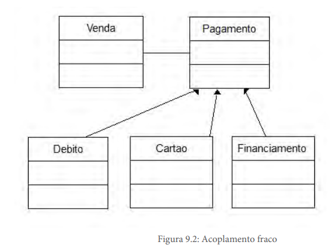

# Introdução

## Programação Imperativa

- Conceito definido por John Von Neumann
- Deve-se dar ordens ao computador de forma sequencial
- Base para a criação de linguagens de alto nível

## Paradigma Estruturado

- Segue a programação imperativa
- Simplicidade em expressar algoritmos
- Exemplos de linguagens: C, Pascal
- É predecessor do Paradigma Orientado a Objetos
- Defende que é possível representar todo processo do mundo real a partir de 3 estruturas básicas:
    - Sequência
        - Os passos devem ser executados um após o outro, linearmente
        - Um programa é uma sequência finita de passos
    - Decisão
        - Uma determinada sequência de código pode ou não ser executada
        - Utiliza-se um teste lógico para determinar ou não a execução de uma sequência
        - Estruturas de decisão: if-else e switch
    - Iteração
        - Execução repetitiva de um segmento do programa
        - Usa um teste lógico para determinar a quantidade de repetições
        - Estruturas de repetição: for, foreach, while, do-while, repeat-until
    - Problemas
        - Quanto mais complexo se torne um programa, mais difícil fica a manutenção de uma sequência organizada de código

## Paradigma Orientado a Objetos

- Melhor expressividade das necessidades do nosso dia a dia
- Criar unidades de código mais próximas da forma como pensamos e agimos

## Programação Orientada a Objetos (POO)

- Processo de utilizar uma linguagem orientada a objetos
- Reuso por meio de Herança e Associação

## Histórico da Orientação a Objetos (OO)

- País de origem: Noruega
- Data de origem: década de 1962
- Primeira linguagem OO: Simula 1 e Simula 67
- Na década de 70 linguagem Smalltalk-71 até Smalltalk-80 - tornou a OO conhecida

## Coesão

- Princípio que preconiza que cada unidade de código deve ser responsável por possuir informações e executar tarefas que dizem respeito somente ao conceito que ela pretende representar. 
- Ideia: Não misturar responsabilidades
- Para atingir uma boa coesão é necessário dividir responsabilidades

## Acoplamento

- É o nível de interdependência entre os códigos

## Generalização

- Processo de se pensar no mais abstrato

## Especialização

- Processo de …

## Introdução a Orientação a Objetos

- Definição: “A Orientação a Objetos é um paradigma de análise, projeto e programação de sistemas de software baseado na composição e interação entre diversas unidades de software chamadas de objetos”.
- Fundamentos (Pilares)
    - Abstração
        - Processo pelo qual se isolam características de um objeto, considerando os que tenham em comum certos grupos de objetos
        - “Não devemos nos preocupar com características menos importantes (acidentais)”
        - Devemos nos concentrar apenas nos aspectos essenciais
        - Abstrações devem ser incompletas e imprecisas quando comparadas com as características reais
    - Reúso
        - Repetição de código é uma má prática em programação
        - Obtido por meio da herança e da associação (uma classe pede ajuda a outra para fazer o que não consegue fazer sozinha), por exemplo
    - Encapsulamento
        - Esconder complexidades de implementação e fornecer apenas o resultado gerado
        - Quem usa um processamento não será afetado quando o seu comportamento interno mudar
        - Ocultar informações: blindagem de aspectos internos do objeto em relação ao mundo exterior
        - A casca são os métodos
- Conceitos chave da OO
    - Estruturais
    - Relacionais
    - Organizacionais

# **Conceitos Estruturais da OO**

## Classe

- É uma estrutura que abstrai um conjunto de objetos com características similares.
- Define o comportamento dos seus objetos através de métodos e os estados possíveis destes objetos através de atributos.
- Em outras palavras: descreve os serviços providos por seus objetos e quais informações eles podem armazenar
- É uma abstração de uma entidade, seja ela física (bola, pessoa, carro) ou conceitual (viagem, venda, estoque) do mundo real
- A partir de substantivos podemos identificar quais as entidades o software precisará modelar
- Ao criar uma classe estamos definindo um tipo abstrato de dado
- Membros de uma classe/objeto: atributos e métodos
- Classes/Objetos são tipos de dados primitivos definidos por programadores

## Atributo

- É o elemento de uma classe, responsável por definir sua estrutura de dados
- São informações que a classe pode armazenar e manipular
- Representados a partir de substantivos ou adjetivos
- Possui um tipo
- Utilizar nomes compostos para os atributos: tipoCliente
- ```this```: palavra reservada usada parra autorreferência, usada por exemplo para diferenciar parâmetros que tenham o mesmo nome de um atributo

## Método
 
- É uma porção de código que é disponibilizada pela classe.
- Definem e realizam um determinado comportamento
- Executa as operações que a classe fornecerá
- Essas operações têm como finalidade manipular os atributos
- Identificados a partir de verbos (ações)
- Assinatura de um método: nome do método e sua lista de parâmetros
- Podemos ter uma classe passada por parâmetro e/ou tipos primitivos
- Se você passa muitos parâmetros separados, talvez eles possam representar algum conceito em conjunto e valeria a pena avaliar se não seria melhor criar uma classe para aglutiná-los
- Retorno: pode ser uma classe, um tipo primitivo ou void (sem retorno)
- Getters e Setters: usar com parcimônia, especialmente o set
- Métodos especiais
    - Construtor
        - Cria objetos da classe, provê valores iniciais aos objetos
        - Possui o mesmo nome da classe, é sem retorno (omite-se a palavra void) e pode ou não ter parâmetros
        - Em C# e Java o construtor implícito (ou padrão) não possui parâmetros
        - Em Python o nome do construtor é init e não tem necessariamente o mesmo nome da classe
    - Destrutor
        - Destrói o objeto da classe
        - Em C#: 
            - ~NomeClasse() { }
        - Exemplo de uso: liberação de uma porta de uma impressora
        - C# possui também um método destrutor implícito
        - Devido ao Garbage Collector (que elimina objetos ociosos) não precisamos nos preocupar com métodos destrutores
- Sobrecarga de Métodos
    - Método com mesmo nome porém com parâmetros diferentes
- Método Main: servem para ser o ponto de entrada, o início da execução de um programa


## Objeto

- É uma instância de uma classe
- É uma representação de um conceito/entidade do mundo real, que pode ser física (bola, carro) ou conceitual (viagem, estoque, compra) e possui um significado bem definido para um determinado software.
- Utilização do operador new
- Estado de um Objeto          
    - É o conjunto dos valores dos seus atributos em um determinado momento
- Determinar se dois objetos são iguais:
    - equals: retorna um booleano
    - Hashcode (representação numérica) de um objeto
        - tabela hash (tabela de dispersão)
        - o hashcode serve para otimizar a pesquisa
- Representação padrão de um objeto
    - Atributos que melhor conseguem representá-lo
    - Método ```toString()```
    
## Tipos de Atibuto e Método

- Podem ser de instãncia ou estático
    - De instância:
        - São definidos na classe porém pertencem ao objeto (só podem ser acessados a partir de uma instância de uma classe)
        - São o padrão
    - Estático
        - Pertencem a classe e não ao objeto
        - Valores armazenados num atributo estático são iguais em todos os objetos criados a partir da classe que o contém
        - Atributo estático, ex.: ```static int quantidadeDeOlhos;```
        - Devemos usar métodos estáticos apenas quando o uso dos métodos não requer a criação de objetos para  a sua execução
        - O método estático é independente e só foi criado dentro de uma classe pois a classe é a unidade mínima de programação no paradigma OO.
        - Ex.: Classe Math

## Mensagem

- Processo de ativação de um método de um objeto (ou de uma classe, caso seja um método estático).
- Ocorre quando há uma chamada ao método
- Ao requisitar que um comportamento de um método seja executado, estamos passando uma mensagem a este método. 


## Exemplo: Criação de um Personagem

- Cria-se uma caixa (diagrama UML) com 3 seções: nome da classe, atributos e métodos.
- UML (Unified Modeling Language - Linguagem de Modelagem Unificada)
    - É uma linguagem gráfica de modelagem de sistemas orientados a objetos.
    - É um padrão mundialmente aceito
    - Link: https://www.uml.org/




# **Os Conceitos Relacionais** (Os Relacionamentos entre classes)

- Úteis para criar classes a partir ou com a ajuda de outras classes.

## Herança

- Herança é o relacionamento entre classes em que uma classe chamada subclasse (classe filha ou classe derivada) é uma extensão ou subtipo de outra classe chamada superclasse (classe pai, classe base).
- A subclasse consegue reaproveitar atributos e métodos da superclasse, além de definir os seus próprios membros.
- É útil quando precisamos obter um reúso de membros de uma superclasse e uma definição de subtipos.
- Só existe herança entre classes (a frase "o objeto X herdou de Y" está incorreta, pois os objetos só existem em tempo de execução).
- Utilizar no máximo 4 níveis (ou hierarquias de classes) de herança (muitos níveis tornam o código complexo de entender).
- Relaciona-se com o reúso.
- Ao definir uma classe da forma mais abstrata possível necessitamos reusar seu conceito e seus membros em outros conceitos similares.
- Quando uma classe herda de outra ela poderá acrescentar novos membros porém não poderá excluir.
- Herança: um conceito "é do tipo" de outro conceito.
- Podemos usar herança quando esta pergunta for verdadeira: "uma coisa é a outra" ?
    - Ex.: Um médico é um funcionário ?
- Em C# a herança é feita com o símbolo ```:```.    

### Exemplo

- A superclasse Pessoa serviu de base para as classes Paciente e Funcionario.
- A seta sempre aponta para a classe mãe.
- Quanto mais se sobe na hierarquia de classe mais genérico fica e quanto mais desce mais específico.



~~~csharp
namespace ConsoleAppPoo
{
    public class Pessoa
    {
        public string Nome { get; set; }
        public string Sexo { get; set; }
    }
}

namespace ConsoleAppPoo
{
    public class Paciente : Pessoa
    {
        public DateTime dataInternacao { get; set; }
    }
}

namespace ConsoleAppPoo
{
    public class Funcionario : Pessoa
    {
        public DateTime dataAdmissao { get; set; }
        public string Matricula { get; set; }
    }
}

namespace ConsoleAppPoo
{
    public class Medico : Funcionario
    {
        public string CRM { get; set; }
        public void operar()
        {
            Console.WriteLine("Realizando operação");
        }
    }
}

namespace ConsoleAppPoo
{
    public class Gerente : Funcionario
    {
        public string CRA { get; set; }
        public void liberarPagamento()
        {
            Console.WriteLine("Pagamento liberado");
        }
    }
}
~~~

### Tipos de Classe

#### Classes abstratas

- Implementação completa do conceito de abstração.
- Representam conceitos tão genéricos que não vale a pena trabalhar com eles diretamente.
- Esses conceitos são incompletos e devem ser completados pelas classes que herdarem dela (seus subtipos).
- Justamente por isso elas não podem ser instanciadas.
- Geralmente estão no topo da hierarquia de classes.
- Exemplo do hospital: talvez não faça sentido instanciar objetos da classe Pessoa, logo, ela pode ser abstrata

~~~csharp
namespace ConsoleAppPoo
{
    public abstract class Pessoa
    {
        public string Nome { get; set; } = "aaa";
        public string Sexo {get; set;}
    }
}
~~~

- Uma classe abstrata pode herdar de outra classe abstrata (fato não muito comum), ex.:

~~~csharp
namespace ConsoleAppPoo
{
    public abstract class Funcionario : Pessoa
    {
        DateTime DataAdmissao { get; set; }
        string Matricula { get; set; } 
    }
}
~~~

- A classe abstrata servirá de molde para outras classes.
- Métodos também podem ser abstratos (para que ele também sirva de molde - não deve possuir implementação, mas sim somente a sua assinatura).
- Um método abstrato só pode ser definido em uma classe abstrata, porém classes abstratas podem possuir também métodos não abstratos (isto é, que possuem implementação).

~~~csharp
namespace ConsoleAppPoo
{
    public abstract class Medico : Funcionario
    {
        // Método abstrato
        public abstract void Operar();

        // Método não abstrato
        void DarAtestado()
        {
            Console.WriteLine("Dar o atestado");
        }
    }
}
~~~

- Por padrão todo método é não abstrato.
- Não existem atributos abstratos.
- É possível instanciar uma classe abstrata utilizando o conceito de Classes Anônimas.
- Se uma classe abstrata herdar de outra classe abstrata, ela não precisa implementar os métodos abstratos que superclasse possui.

#### Classes concretas

- Se uma classe não é abstrata, ela só pode ser concreta.
- Não são genéricas, mas sim bem específicas.
- São de uso direto, espera-se que utilizem os seus métodos e atributos.
- Representam o conceito de uso direto, por isso devem ser instanciadas.
- Se uma classe concreta herda a partir de uma classe abstrata que possua métodos abstratos, a classe concreta terá que prover a implementação para tais métodos abstratos.


### Tipos de Herança

#### Herança Simples

- Ocorre quando uma subclasse tem apenas uma superclasse.

#### Herança Múltipla

- Ocorre quando uma subclasse necessita de duas ou mais superclasses.
- A classe filha poderá especializar mais de um conceito de uma aplicação.
- Ex.: a classe MedicoGerente herdar da classe Medico e da classe Gerente.
- C# não possui herança múltipla (devido ao conflito de nomes em casos onde as duas superclasses possuem um atributo de mesmo nome), porém C++ possui.
- Existem meios para emular a herança

### Upcast 

- Operação de conversão de subclasses em superclasses.
- É permitida pois a classe filha é do tipo da classe mãe.
- Ocorre implícitamente (analogia com float = int).

~~~csharp
Pessoa pessoa;
pessoa = new Medico();
pessoa = new Paciente();
pessoa = new Funcionario();

Funcionario funcionario = new Gerente();

Medico medico = new Anestesista();
~~~

### Downcast

- Operação de conversão de subperclasses em subclasses.
- Deve ser desencorajado, pois podem haver várias especializações distintas a partir de uma generalização.
- Ex.: Nem todo funcionario é um medico.

~~~csharp
Funcionario funcionario1 = new Gerente();
Gerente gerente1 = funcionario1 as Gerente;

Funcionario funcionario2 = new Funcionario();
Gerente gerente2 = funcionario2 as Gerente;
~~~

### Polimorfismo

- Em determinados momentos em uma hierarquia de classes precisamos que um mesmo método (assinatura = nomeMetodo + listaParametros) se comporte de forma diferente dependendo do objeto instanciado a partir de uma classe nessa hierarquia.
- Surge da necessidade de flexibilidade que a hierarquia de classes deseja fornecer.
- Polimorfismo: "Uma mesma ação que pode se moldar de acordo com o objeto em questão".
- Em cada subclasse um método da superclasse pode ser implementado de modo diferente.

~~~csharp
class Parto : Procedimento
{
    Medico[] medicos = new Medico[] {new Anestesista(), new Obstetra(), new Pediatra() };

    void RealizarParto()
    {
        for(int i = 0; i < medicos.length; i++>)
        {
            Medico medico = medicos[i];
            medico.Operar();
        }
    }
}
~~~

- A melhor forma de possibilitar o uso de polimorfismo é trabalhar com classes e métodos abstratos. Assim, definimos a assinatura do método e deixamos para a subclasse definir a implementação do método.

~~~csharp
class Anestesista : Medico
{
    override void Operar()
    {
        // implementação do método operar
    }
}

// ... o mesmo para Obstetra e Pediatra
~~~

- Há uma relação intrínseca entre polimorfismo e herança: **para poder existir polimorfismo é necessário que se tenha uma herança**. Porém ao utilizarmos herança não devemos obrigatoriamente utilizar o polimorfismo.

### A Sobrescrita

- Ocorre quando uma implementação de um método é sobrescrita (redefinição).
- A subclasse redefine o método herdado e a sobrescrita é realizada. O método da superclasse deixa de ser utilizada e o método da subclasse passa a ser utilizado.
- Do ponto de vista de implementação, o polimorfismo e a sobrescrita são muito parecidos, porém:
    - A sobrescrita sobrescreve algo existente (um comportamento padrão da superclasse).
    - No polimorfismo não há a necessidade de haver um comportamento padrão na superclasse, uma vez que o método da superclasse pode ser abstrato. 
- Toda a sobrescrita também é um polimorfismo, porém nem todo polimorfismo é uma sobrescrita (caso na superclasse o método seja abstrato - polimorfismo puro).

~~~csharp
class Anestesista : Medico
{
    void Operar()
    {
        // implementação
    }
}

class ResidenteAnestesista : Anestesista
{
    override void Operar()
    {
        // implementação sobrescrita
    }
}
~~~

- Para o método sobrescrito utilizar na subclasse integralmente o comportamento do método da superclasse e depois adicionar alguns passos específicos, ele pode:

~~~csharp
class ResidenteAnestesista : Anestesista
{
    override void Operar()
    {
        base.Operar(); // utiliza o método da superclasse
        // implementação sobrescrita
    }
}
~~~

## Associação

- Motivação:
    - A herança falharia para relacionar as classes Endereço e Medico, pois um Medico não é um Endereço, porém um Médico possui um Endereço.
    - A pergunta que se faz é: um Medico **possui** um Endereço ?
    - Podemos ver que a classe Medico deve se associar à classe Endereco para completar a sua representatividade.
    - O Medico por si só não consegue representar o conceito de endereço, precisa relacionar-se com alguém.
- A Associação possibilita um relacionamento entre classes/objetos, no qual estes possam pedir ajuda a outros e assim representar de forma completa o conceito no qual se destinam. Neste tipo de relacionamento, as classes e os objetos interagem entre si para atingir seus objetivos.
- O que possibilita a troca de informações na associação é o conceito de mensagem.

### Os tipos de associação: agregação, composição e dependência

- A associação pode ser realizada de duas formas:
    - Estrutural
        - Possui dois tipos: Agregação e Composição
        - A associação ocorre na estrutura da classe, mais precisamente nos atributos: um dos atributos de uma classe é do tipo de outra classe
        - No ex. a seguir os objetos da classe Medico terão acesso aos atributos do objeto criado da classe Endereco.
        - Composição
            - Ocorre quando um relacionamento da forma "parte todo" ocorre.
            - A parte não pode existir sem a existência do todo.
            - Ex.: um endereço específico só pode existir se pertencer a um e unicamente um médico. Não haveria finalidade alguma esse endereço existir sem estar ligado a um médico, empresa, etc.
            - Há uma forte relação entre a parte (o endereço) e o todo (o médico)
            - O médico é composto por um endereço e este pertence somente a este médico.
        - Agregação
            - Ocorre quando o relacionamento "parte todo" não ocorre.
            - A parte pode ser compartilhada entre vários objetos (todos) distintos.
            - Ex.: o procedimento Parto será executado na "Sala 02" no período da manhã, ná o procedimento RevascularizacaoMiocardio também será executado na "Sala 02", só que pela tarde.
            - A parte (sala) pode pertencer a 2 "todos" distintos, que no caso são os procedimentos.
            - A sala agrega-se para formar a estrutura desses procedimentos, mas não compõe única e exclusivamente somente um deles.
        - Do ponto de vista de implementação, composição e agregação são idênticos, mas conceitualmente são diferentes.
    - Comportamental
        - Possui um tipo: Dependência
        - Muitas vezes precisamos passar objetos como parâmetros para os métodos, ou mesmo instanciar objetos dentro do corpo dos métodos. Com isso temos acesso aos membros desses objetos para nos ajudar a realizar as tarefas necessárias. Isto é associação comportamental
        - Essa associação faz parte de um método, seja através de seu parâmetro ou de uma instanciação direta em seu corpo.

~~~csharp
// ex.: associação estrutural composição
abstract class Medico : Funcionario
{
    Date CRM;

    // Aqui está a associação
    Endereco endereco;

    void Operar()
    {
        // implementacao desejada
    }
}
~~~

~~~csharp
// ex.: associação estrutural agregação
class RevascularizacaoMiocardio : Procedimento
{
    // Aqui está a associação
    Sala sala;
}
~~~

### As características de uma associação: unária, múltipla, cardinalidade e navegabilidade

- Associação unária
    - Atributo é do mesmo tipo da classe

~~~csharp
class Beneficiario
{
    string nome;
    Date dataNascimento;
    string tipoBeneficiario;
    Beneficiario dependente; // mesmo tipo da classe
}
~~~

- Associação múltipla
    - Há vários tipos de classe envolvidas na associação
- Cardinalidade
    - No exemplo acima há 3 médicos e uma sala envolvidos na associação. Essa quantidade corresponde à cardinalidade destas associações.
    - Cardinalidades podem ter quantidades fixas ou não ter um valor fixo (ser quantas forem necessárias)
    - Serve para identificar quantos objetos a associação possui

~~~csharp
class Parto : Procedimento
{
    Medico[] medicos = new Medico[]{ new Anestesista(), new Obstetra(), new Pediatra() };
    Sala sala;
}
~~~

- Navegabilidade
    - Pode ser unidirecional ou bidirecional
    - Unidirecional: associação só ocorre de um lado    

~~~csharp
class Parto: Procedimento
{
    Medico[] medicos = new Medico[]{ new Anestesista(), new Obstetra(), new Pediatra() };
    Sala sala;
}

class Sala
{
    Parto[] partos; // torna a navegabilidade bidirecional
}
~~~

## Interfaces

- Em algumas aplicações que necessitam de uma modelagem um pouco mais elaborada, muitas vezes é preciso determinar um conjunto de métodos que devem obrigatoriamente ser usados.
- Porém como esses métodos são implementados não importa para quem definiu tal conjunto. Essa obrigatoriedade de definição de métodos chama-se interface.
- Uma Interface define um contrato que deve ser seguido pela classe que a implementa. 
- Quando uma classe implementa uma interface, ela se compromete a realizar todos os comportamentos que a interface disponibiliza.
- É uma obrigatoriedade de definição de métodos
- Para numa modelagem determinar um conjunto de métodos que devem obrigatoriamente ser usados
- É obrigatório para a classe prover o comportamento, mas como este será realizado é irrelevante para a interface
- É uma boa prática colocar a letra "I" no início do nome das interfaces
- Por padrão todo método de uma interface é abstrato e por ser padrão não é preciso colocar a palavra abstract
- A interface se comporta como uma classe abstrata, porém mais restritiva, pois em classes abstratas pode-se ter métodos não abstratos, porém em interfaces isso não é possível
- Métodos abstratos só podem ser definidos em classes abstratas e interfaces.
- Se necessário podemos definir atributos nas interfaces que serão sempre públicos, estáticos e constantes.
- Em Java e C# uma classe pode implementar mais de uma interface (mecanismo alternativo para a herança múlipla, ausente nessas linguagens). Basta separá-las por vírgula.

> Sempre que a ideia é fornecer o contrato de implementação, sem querer se preocupar com a implementação em si, nada melhor do que utilizar um método abstrato

~~~csharp
/* Exemplo onde a classe TransmissaoDadosMinisterio implementa a interface IDemonstrativoOperacional */
interface IDemonstrativoOperacional
{
    // métodos sem corpo
    double DisponibilizarFaturamentoMensal();
    Procedimento[] InformarProcedimentosExecutados();
}

class TransmissaoDadosMinisterio : IDemonstrativoOperacional // "implementa"
{
    public double DisponibilizarFaturamentoMensal()
    {
        // ...
    }

    public Procedimento[] InformarProcedimentosExecutados()
    {
        // ...
    }
}
~~~

~~~csharp
// Implementando mais de uma interface
interface IUm
{
    //...
}

interface IDois
{
    //...
}

class Classe1 : IUm, IDois 
{
    //...
}
~~~

# **Conceitos Organizacionais**

- Objetivos: 
    - Aglutinar classes que representam conceitos similares ou que compartilham as mesmas finalidades.
    - Limitar acesso aos membros das classes 

## Pacotes

- Um pacote é uma organização física ou lógica criada para separar classes com responsabilidades / finalidades distintas.
- Em C# os pacotes são chamados de `namespaces` (espaços de nomes para a separação lógica de classes com finalidades distintas)
- Ao contrário de Java, C# não obrigatoriamente cria pastas ao criarmos um namespace. 
- A separação de classes em C# pode ocorrer de forma lógica (e não física), mas se for preciso, pastas podem ser criadas.
- Em C# é permitida a criação de subnamespaces, como `entidades.Funcionario`, onde `entidades` é o namespace e `Funcionario` é o subnamespace.
- Ao separar as classes em pacotes utilizamos a palavra chave `using` para que elas se enxerguem.

## Visibilidades

- Também chamadas de modificadores de acesso.
- Têm como finalidade controlar o acesso de classes, atributos e métodos.
- A OO prevê 3 visibilidades: privada, protegida e pública:
    - **Private**
        - Visibilidade mais restritiva. Os atributos e métodos podem ser manipulados somente dentro da classe onde foram definidos.
        - É a principal visibilidade. Através dela que alguns dos princípios fundamentais da OO são aplicados.
    - **Protected**
        - Visibilidade intermediária. Os atributos e métodos só podem ser manipulados na classe onde foram definidos *E* nas classes que herdam dela (subclasses).
    - **Public**
        - Visibilidade menos restritiva. Os membros assim definidos são acessíveis em qualquer lugar.
        - Pode possibilitar acessos indevidos de atributos e usos indevidos de métodos.
- Pela orientação a objetos são somente essas 3 visibilidades, porém algumas linguagens fornecem outras, como:
    - **Internal**
        - Membros de classe podem ser utilizados em qualquer lugar do projeto, mas limita o uso desses membros somente ao projeto corrente.

# Utilização

## Projeto orientado a objetos

- Entender o domínio do sistema que se deseja desenvolver;
- Identificar as entidades (objetos com atributos e métodos)
- Geralmente o domínio inicial não é completo o suficiente, então é comum algumas necessidade surgirem ao longo do desenvolvimento.

#### Processo de Modelagem

- Reconhecimento das entidades
    - Todas as entidades são modeladas como classes
    - Criação de uma superclasse abstrata chamada Pessoa, da qual as classes Medico e Paciente serão subclasses.
    - Associação da superclasse Pessoa com um Endereco.



- Definição de atributos
    - Após o reconhecimento das entidades, é a hora de definir seus atributos e métodos
    - Por boa prática todos os atributos devem ser privados.



- Definição de métodos
    - Por padrão a maioria dos métodos será pública
    - a visibilidade pública é representada por (+)
    - a visibilidade privada é representada por (-)



#### Processo de Codificação

- Qual vertente (forma) da programação OO utilizar?
    1. Padrão Business Object
        - Os atributos e métodos são separados (isso quebra uma das principais características da OO: aglutinar dados e comportamentos na mesma unidade de código)
        - Objetivo: ter uma alta reusabilidade dos comportamentos, sem que isso interfira no modelo de entidades (conceitos) da aplicação
        - Ex.: classes para representar pacientes de um hospital:
            - Haveria uma classe Paciente que representa somente o conceito (entidade) a ser manipulado e assim teria somente atributos;
            - Haveria uma classe PacienteBO ou PacienteBusiness que iria conter somente os métodos que manipulam um paciente
            - Isso fere um pouco o encapsulamento.
            - É como "programar de forma estruturada utilizando orientação a objetos"
            - Mesmo assim é uma forma muito usada pois torna o código menos complexo e facilita o seu entendimento
            - Quanto mais relacionamentos as entidades apresentarem entre si, mais útil essa abordagem se torna
    2. Vertente sem o Modelo Anêmico
        - Prega a não utilização do Padrão Business Object
        - Busca seguir os preceitos da OO: juntar dados e comportamentos
        - No caso do Paciente somente uma classe seria criada (a classe Paciente)
        - É defentida por gurus da OO, como Martin Fowler
        - Gera menor acoplamento entre as classes da aplicação
        - Diminui a quantidade de classes e consequentemente de relacionamentos
        - Domain Model

## Boas práticas com OO

- Não acessar atributos diretamente
- Todos os atributos devem ser privados
- Trabalhe com alta coesão e baixo acoplamento
    - A falta de coesão leva a classes inchadas e que misturam responsabilidades
    - Um alto acoplamento faz com que uma classe dependa muito de outra
    - Entretanto acoplamentos devem existir, pois uma das características básicas da OO é a troca de mensagens e isso só é possível por meio do acoplamento. Logo, devemos tornar os acoplamentos fracos e flexíveis
    - Um bom acoplamento possibilita que manutenções sejam feitas sem grandes impactos
        
        
- Use Strings com Parcimônia
    - Não use uma stringa para uma variável como `dataAniversario`. Prefira o tipo `Date` (é mais correto sintaticamente falando e gera inúmeras facildiades para manipular datas)
    - Para o campo 'sexo' é preferível utilizar um tipo `Enum` (tipo usado para criar um conjunto fixo e limitado de valores) do que uma string
        ~~~csharp
        public Enum Sexo 
        {
            MASCULINO,
            FEMININO
        }
        ~~~
- Seja objetivo, não tente prever o futuro
    - Evite criar classes genéricas demais, pois seus entendimentos ficam prejudicados e geram um acoplamento muito grande, pois muitas classes dependerão dela e se algum dia for necessária alguma alteração nela, todo os sistema será afetado
    - Siga o princípio KISS (Keep It Simple, Stupid)
    - Usar herança só com o intuito de reúso é um equívoco. A grande vantagem da herança é a criação de subtipos
        - Ex.: se o sistema só faz vendas para pessoas físicas não é necessário criar uma classe Pessoa e dela herdar a PessoFisica.
    - Uma modelagem eficiente é aquela que supre as necessidades do momento e que pode ser evoluída facilmente.
- Crie seus métodos com carinho
    - São nos métodos de uma classe que as coisas realmente acontecem e é onde mais se trabalhará
    - Tamanho: busque criar métodos não muito grandes
        - Subdivida um método grande em métodos privados menores e concisos
    - Repetição de código: utilize reaproveitamento
    - Parâmetros: diminuir a quantidade de Parâmtros, agrupar em classes concisas 
        - Quanto mais se usam parâmetros desassiciados e em grande quantidade, mais acoplamento se cria com este método.
        - Ex.: Se em algum dia algum parâmetro que diga respeito a um cliente precise ser adicionado, provavelmente precisarão ser corrigidos vários pontos da aplicação. Entretanto se um objeto Cliente for passado, as chamadas a esse método ficarão intactas.
- Conheça e use coleções
    - Os arrays possuem algumas limitações: tamanho fixo, dificuldade de pesquisa e controle de inserção de itens.
    - É melhor utilizar uma estrutura que possibilite um maior dinamismo na manipulação dos dados utilizando Coleções!
    - Coleções: listas, conjuntos (evita repetições), mapa (usa chave/valor, acesso mais rápido que listas)
    - O símbolo `<T>` nas coleções é para permitir o uso de generics, que não é um conceito pertencente à OO, mas é útil
        - Ao parametrizar uma coleção com genérics, significa que ela só aceitará o tipo definido nessa parametrização.
- Sobrescreva os métodos `Equals`, `Hashcode` e `ToString`
    - É uma forma de evitar resultados indesejados
- As vezes é preferível associar do que herdar
    - A verdadeira função da herança é criar subtipos.
    - Podemos ter reúso sem ter herança: chamando métodos, por exemplo.
    - Um carrinho de compras não pode herdar da classe list, pois ele não é uma lista. Ele precisa de uma lista
    - Herança: relação do tipo "é um"
    - Associação: relação do tipo "usa um"
    - Impedir que classe seja herdada: palavra reservada `sealed` - ex de uso: classe `String`
        - `public sealed class ...`
        - Usar sempre que a aplicação possuir classes que representam determinados conceitos que já são o fim da hierarquia de classes
        - ou em um método: `public sealed void NomeMetodo() ...`
- Se preocupe com o encapsulamento
    - Aplicações mal projetadas geram uma grande dependência entre as suas classes, pois os métodos não realizam bem a tarefa de esconder as suas complexidades de implementação e atributos acabam sendo acessados diretamente
    - Dicas
        - Defina as visibilidades de forma adequada
            - Via de regra todas as classes são públicas
            - Atributos devem ser sempre privados para ocultar a informação e encapsular o estado interno do objeto
                - exceções: expor constantes, atributos de interface (públicos por padrão), 
            - Métodos devem ser públicos por padrão
                - Métodos privados devem ser usados apenas para organizar a codificação interna da classe
        - Cuidado com gets e sets
            - Quebram facilmente o encapsulamento. Um set quebra a blindagem do estado interno do objeto
            - Para substituir o set, faça sobrecargas do construtor, provendo o estado uma única vez e eliminando a necessidade do uso do set.
            - Para substituir o get, faça métodos de negócio: 
                - Não exponha diretamente o valor do atributo para depois fazer um procedimento com ele. O melhor é disponibilizar tal procedimento.
                - Procedimento: "Tell, don't ask". (diga, não pergunte) - Quanto menos encapsulado é um código, menos pergunta se faz.
                    - Ex.: é ruim ter que verificar se a data de pagamento é != null para verificar se o pagamento foi realizado!!
        - Uso de classes imutáveis
            - Blindam por completo o estado de um objeto impedindo que ele mude após a sua criação.
            - Úteis em programação concorrente, onde vários "programas" precisam acessar o mesmo objeto
            - Dicas para criar classes imutáveis
                - Não criar os métodos set, preferir usar construtores com parâmetros
                - Tornar a classe `sealed`
                - Declarar que os atributos sejam `private` e `readonly`
- Saiba utilizar interfaces e classes abstratas no momento certo
    - Classe Abstrata
        - Classe que serve de molde para outras classes.
        - É a implementação direta do conceito de abstração e devido a isso não pode ser instanciada.
        - Pode possuir métodos abstratos e não abstratos.
    - Interface
        - É a definição de um contrato, uma obrigatoriedade de implementação dos serviços providos.
        - Provê somente as assinaturas dos métodos, deixando para quem implementa tal interface prover o comportamento desses métodos.
        - Por padrão todos os seus métodos devem ser públicos e abstratos.
    - Interfaces podem ser utilizadas para emular herança múltipla, porém isso pode gerar acoplamentos.
        - Ex.: adicionar um novo método na interface faz com que todas as classes que a implementam precisem implementar esse método.
    - Interfaces são menos flexíveis do que classes abstratas
- Classes curinga são difíceis de manter
    - São classes que possuem mais de uma responsabilidade, ou seja, representam mais de um conceito.
    - Possuem baixa coesão e são difíceis de manter
    - Ex.: classe pessoa que visa tratar de pessoa física e de pessoa jurídica ao mesmo tempo (ela teria tanto cpf quanto cnpj e isso é ruim). 
        - Solução: criar uma classe abstrata Pessoa com atributos comuns (nome, etc) e fazer PessoaFisica (com cpf) e PessoaJuridica (com cnpj) derivar dela
- É uma má prática usar interfaces para armazenar constantes (Constant Interface Pattern)
    - Solução: usar uma Enum
- Conheça e utilize as convenções (boas práticas) de condificação da linguagem escolhida
    - Nomes de métodos
    - Nomes de classes e interfaces
    - Nome de constantes

## O que vem depois da OO

- Livro: Padrões de Projeto: soluções reutilizáveis de software orientado a objetos, de Erich Gamma, JV, RJ e RH (2000)
    - "Gangue dos quatro"
    - Um padrão de projeto é (segundo o livro)
        - "Descreve um problema no nosso ambiente e o cerne de sua solução, de tal forma que você possa usar essa solução mais de um milhão de vezes, sem nunca fazê-lo da mesma maneira".
    - Categorias de Padrões
        - Criação
            - gerenciar a instanciação de objetos
        - Estrutural
            - gerenciar como classes e objetos se relacionam para criar novas classes e objetos
        - Comportamentais
            - gerenciar algoritmos e comunicações entre classes e objetos
    - Linguagem utilizada: Smalltalk, mas podem ser implementados em C#, Java, etc

- Refatoração    

# *Continuar em* 

- pag 236

# Exercícios

## Polimorfismo

1. Buscar exemplos no chatgpt sobre polimorfismo

# Fonte

- Livro: Orientação a Objetos - Aprenda seus conceitos e suas aplicabilidades de forma efetiva - T. L. Carvalho